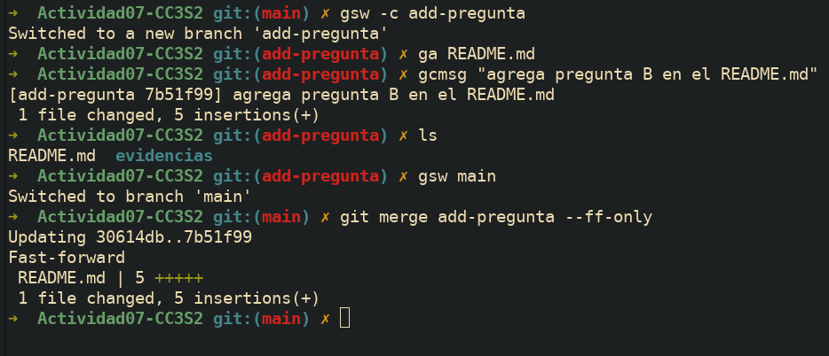
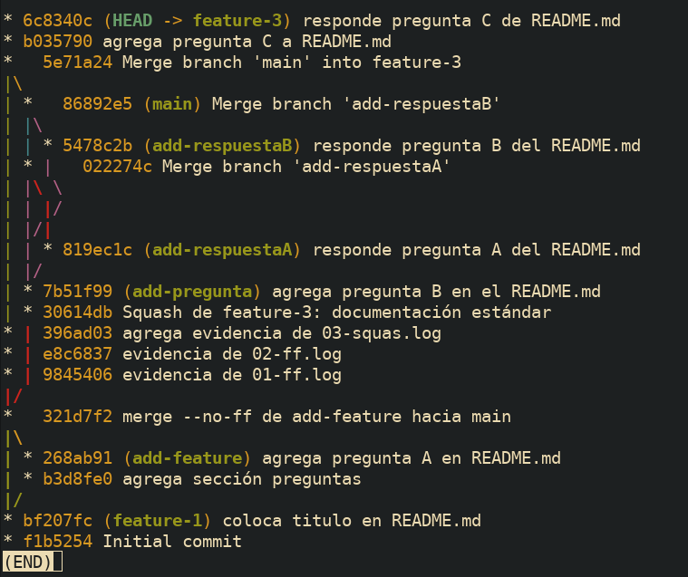
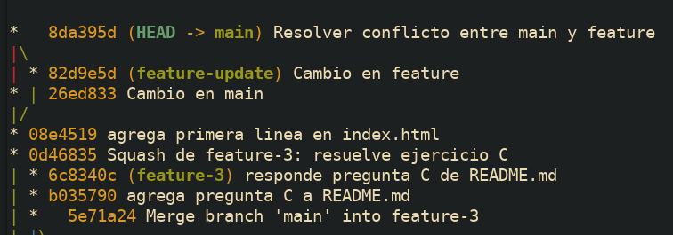
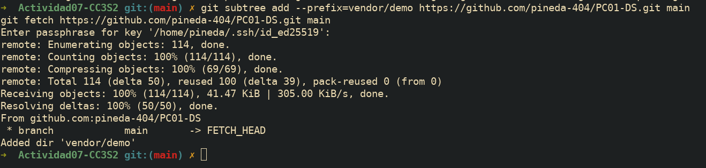
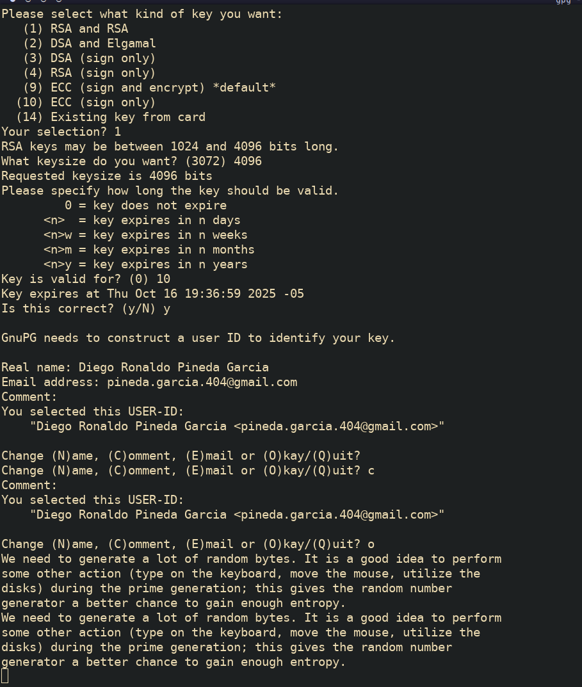

## Repositorio para la Actividad 7

### Preguntas

#### A) Evitar (o no) `--ff`

- Ejecuta una fusión FF real (ver 1).
- **Pregunta:** ¿Cuándo **evitarías** `--ff` en un equipo y por qué?
  Evitaria --ff-only cuando el equipo necesita preservar el contexto explícito de una fusión. Aveces los equipos no desean usar opciones como un rebase ya que sobreescribe el historial de las ramas. Otra razon podria ser que los merges marcan hitos importantes como una version o una funcionalidad agregada.

#### B) Trabajo en equipo con `--no-ff`

- Crea dos ramas con cambios paralelos y **fusiónalas con `--no-ff`**.
- **Preguntas:** ¿Qué ventajas de trazabilidad aporta? ¿Qué problemas surgen con **exceso** de merges?
  La principal ventaja de --no-ff es que preserva explícitamente el contexto de la fusión, exigiendo que se cree un merge commit incluso cuando no es realmente necesario.
  El exceso de merges ensucia y hace mas complicado de entender el historial de commits.

#### C) Squash con muchos commits

- Haz 3-4 commits en `feature-3` y aplánalos con `--squash`.
- **Preguntas:** ¿Cuándo conviene? ¿Qué se **pierde** respecto a merges estándar?
  Los casos donde convienen hacer un squahs son:
- Para limpiar el "ruido" del desarrollo
- Para tratar una funcionalidad como una unidad atómica
- Para simplificar el historial
  Lo que se pierde seria el contexto explicito de la fusión, el historial de desarrollo y la autoria individual de los commits ya que el nuevo commit tendra como autor a la persona que hizo el squash.

### Conflictos reales con no-fast-forward

¿Qué pasos adicionales hiciste para resolverlo?
Para resolver el conflicto, abrí el archivo en conflicto y eliminé los marcadores (<<<<<<< ======= >>>>>>>), luego ajusté el código para integrar lógicamente ambas funcionalidades

¿Qué prácticas (convenciones, PRs pequeñas, tests) lo evitarían?
Hacer Pull Requests más pequeños y frecuentes reduce la probabilidad de conflictos al integrar cambios de menor tamaño. La comunicación constante en el equipo y la ejecución de tests automatizados antes de fusionar también ayudan a detectar problemas de integración de forma temprana.

### Comparar historiales tras cada método

¿Cómo se ve el DAG en cada caso?
En un merge fast-forward, el DAG se mantiene como una línea recta y simple, ya que no se crea un commit de fusión. En un merge no-ff, el DAG muestra una ramificación explícita que luego se une de nuevo en la rama principal, documentando visualmente dónde ocurrió la integración.

    ¿Qué método prefieres para: trabajo individual, equipo grande, repos con auditoría estricta?
    Para trabajo individual, prefiero rebase o fast-forward para un historial limpio. En un equipo grande, merge --no-ff me parece la mejor opcion porque preserva el contexto de las ramas y para auditoría estricta, merge --no-ff

### Revertir una fusión (solo si HEAD es un merge commit)

¿Cuándo usar git revert en vez de git reset?
Usa git revert para deshacer cambios en ramas públicas o compartidas, ya que crea un nuevo commit que registra la reversión sin alterar el historial existente. git reset, en cambio, modifica destructivamente el historial, por lo que solo debe usarse en ramas locales y privadas.
¿Impacto en un repo compartido con historial público?
Revertir una fusión es la forma segura de deshacerla en un repositorio compartido. Crea un historial claro que muestra que una fusión ocurrió y luego fue intencionadamente revertida, evitando confusiones y problemas de sincronización para otros colaboradores que ya tengan el historial original.

#### E) **Subtree** (integrar subproyecto conservando historial)

#### G) **Firmar** merges/commits (auditoría y cumplimiento)

